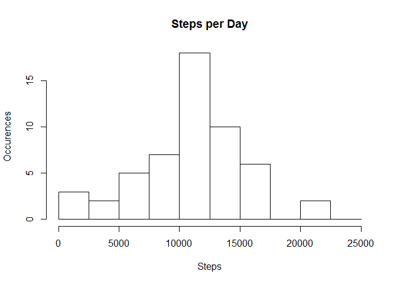
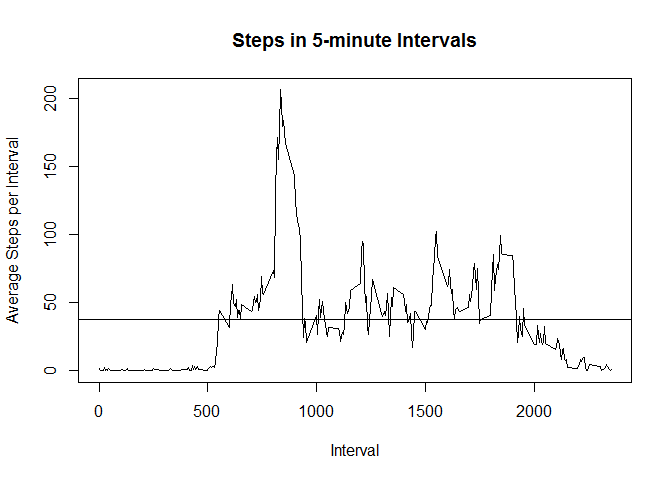
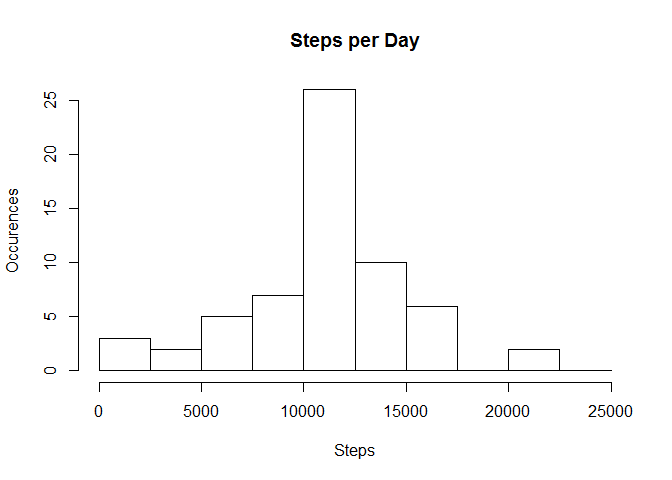
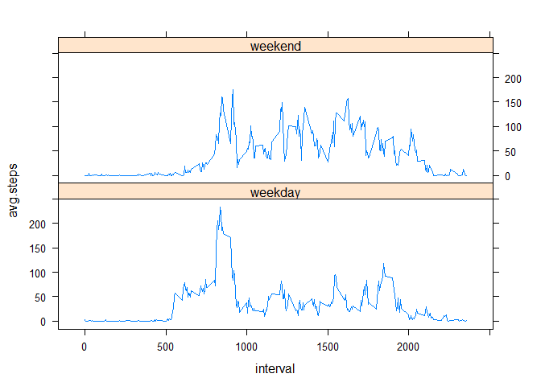

# Reproducible Research: Peer Assessment 1


## Loading and preprocessing the data

```r
setwd("C:/Work/R-Course/ReprodResearch/Week2")

raw.data <- read.csv("activity.csv")
raw.data.wo.na <- raw.data[!is.na(raw.data$steps),]

library(dplyr)
```

```
## 
## Attaching package: 'dplyr'
```

```
## The following objects are masked from 'package:stats':
## 
##     filter, lag
```

```
## The following objects are masked from 'package:base':
## 
##     intersect, setdiff, setequal, union
```

```r
library(ggplot2)
```

```
## Warning: package 'ggplot2' was built under R version 3.4.1
```

```r
library(lattice)
```


## What is mean total number of steps taken per day?


```r
activity.split <- group_by(raw.data, date) 
steps.per.day <- summarise(activity.split, steps=sum(steps))
brks <- seq(0,25000, 2500)
hist(steps.per.day$steps, breaks = brks, main="Steps per Day" ,xlab = "Steps", ylab = "Occurences")
```

<!-- -->

Mean Steps

```r
mean(steps.per.day$steps, na.rm = TRUE)
```

```
## [1] 10766.19
```

Median Steps

```r
median(steps.per.day$steps, na.rm = TRUE)
```

```
## [1] 10765
```


## What is the average daily activity pattern?

```r
activity.split <- group_by(raw.data.wo.na, interval)
steps.per.interval <- summarise(activity.split, avg.steps=mean(steps))
with(steps.per.interval, plot(interval, avg.steps, type="l", 
                        main="Steps in 5-minute Intervals",xlab= "Interval", ylab= "Average Steps per Interval"))
abline(h=mean(steps.per.interval$avg.steps))
```

<!-- -->

Most Mean Steps in an Interval

```r
steps.per.interval$interval[which.max(steps.per.interval$avg.steps)]
```

```
## [1] 835
```


## Imputing missing values
Number of Missing Values

```r
sum(is.na(raw.data$steps))
```

```
## [1] 2304
```

Calculate Imptuted Values

```r
index <- rep(0,length(raw.data$interal))
for (i in 1:length(raw.data$interval)){
  index[i] <-which(steps.per.interval$interval==raw.data$interval[i])
}
imputed.data <- cbind(raw.data, index)
imputed.data <- mutate(imputed.data, imputed.steps=if_else(is.na(steps),steps.per.interval$avg.steps[index],0))
imputed.data.test <- mutate(imputed.data, steps=if_else(is.na(steps),imputed.steps,1))
for (i in 1:length(raw.data$interval)){
    if(is.na(imputed.data$steps[i])) {imputed.data$steps[i] <-round(imputed.data$imputed.steps[i])}
}
activity.split <- group_by(imputed.data, date) 
steps.per.day.imputed <- summarise(activity.split, steps=sum(steps))
brks <- seq(0,25000, 2500)
hist(steps.per.day.imputed$steps, breaks = brks, main="Steps per Day" ,xlab = "Steps", ylab = "Occurences")
```

<!-- -->

Mean

```r
mean(steps.per.day.imputed$steps)
```

```
## [1] 10765.64
```
Median

```r
median(steps.per.day.imputed$steps)
```

```
## [1] 10762
```


## Are there differences in activity patterns between weekdays and weekends?

```r
raw.data <- mutate(raw.data, day.of.week = weekdays(as.POSIXlt(imputed.data$date)))
raw.data <- mutate(raw.data, week.end = if_else(day.of.week %in% c("Sunday","Saturday"),"weekend","weekday"))

raw.data.wo.na <- raw.data[!is.na(raw.data$steps),]
activity.split <- group_by(raw.data.wo.na, interval,week.end)
steps.per.interval.day <- summarise(activity.split, avg.steps=mean(steps))
steps.per.interval.we <- filter(steps.per.interval.day, week.end=="weekend")
steps.per.interval.wd <- filter(steps.per.interval.day, week.end=="weekday")
par(mfrow=c(2,1))
xyplot(avg.steps ~ interval | week.end, data = steps.per.interval.day, 
       layout = c(1, 2),type="l")
```

<!-- -->
